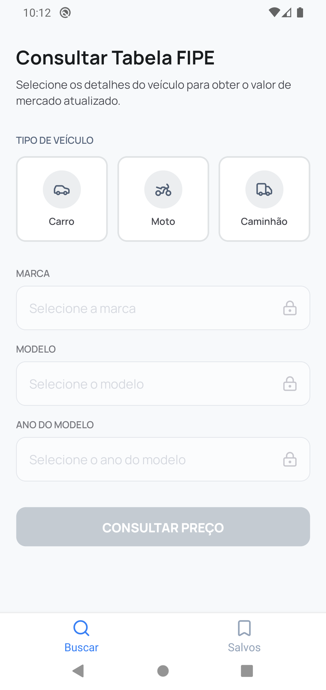
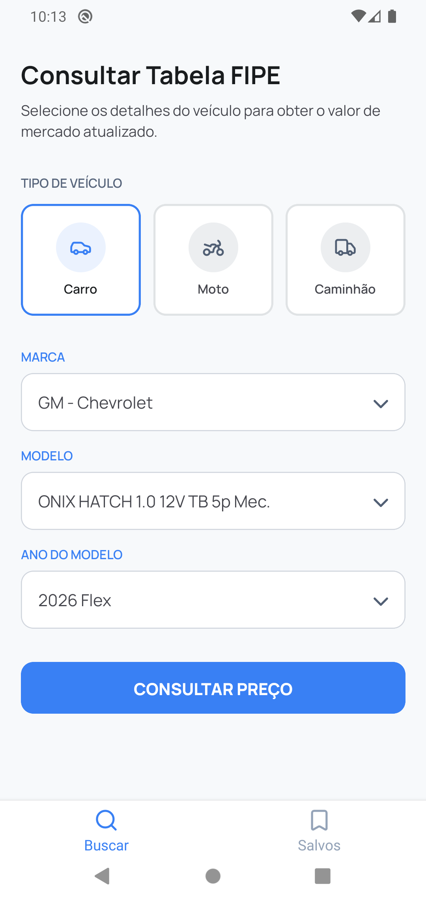
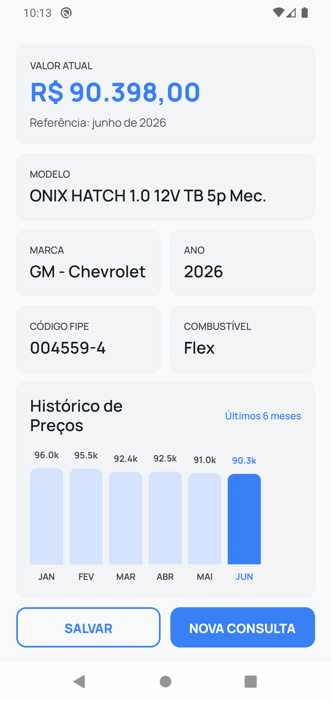
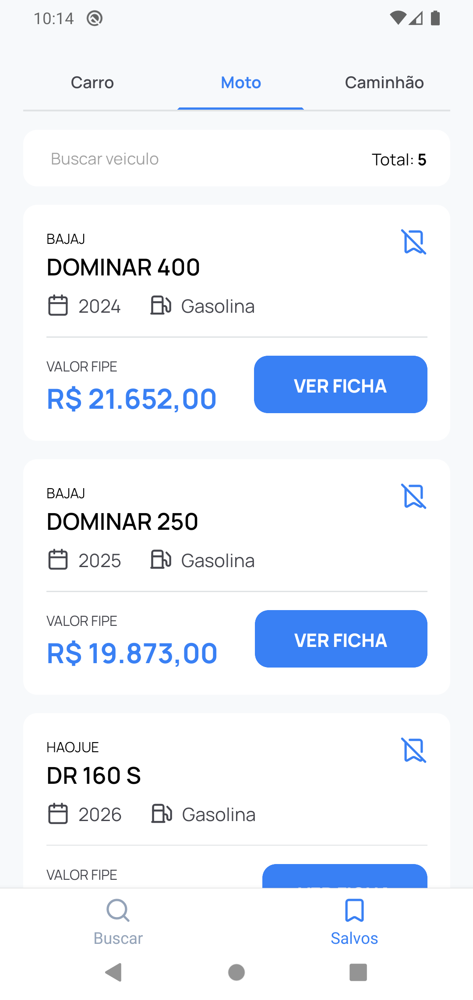
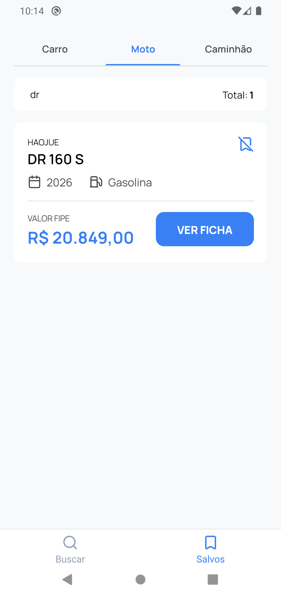

# Info Vehicle

Aplicativo em React Native com Expo para consultar a Tabela FIPE, visualizar o histórico de preços e salvar consultas favoritas no dispositivo.

## Objetivo

O objetivo do projeto é facilitar a consulta de veículos na Tabela FIPE, permitindo que o usuário:

- encontre marcas, modelos e anos de um veículo;
- consulte o preço atual de acordo com a FIPE;
- acompanhe o histórico recente de preços;
- salve consultas para acesso rápido depois.

## Funcionalidades

- Consulta por tipo de veículo:
  - carro
  - moto
  - caminhão
- Seleção de marca, modelo e ano por meio de campos dinâmicos.
- Exibição do valor atual da FIPE e do mês de referência.
- Tela de detalhes com informações do veículo.
- Gráfico com o histórico dos últimos meses.
- Salvamento local de consultas no dispositivo.
- Lista de consultas salvas com busca e filtro por tipo.
- Navegação por abas entre `Buscar` e `Salvos`.

## Screenshots

As imagens abaixo mostram algumas telas do aplicativo:

| Tela | Descrição | Screenshot |
| --- | --- | --- |
| 1 | Tela inicial de consulta, com seleção de tipo de veículo e campos ainda bloqueados até iniciar a busca. |  |
| 2 | Consulta preenchida com carro selecionado, marca, modelo e ano já definidos para buscar o valor da FIPE. |  |
| 3 | Tela de detalhes com valor atual, dados do veículo e gráfico com o histórico dos preços. |  |
| 4 | Aba de salvos exibindo a lista de consultas favoritas organizadas por tipo de veículo. |  |
| 5 | Lista de salvos com busca ativa, mostrando o filtro aplicado e o resultado correspondente. |  |

## Bibliotecas utilizadas

### Principais

- [Expo](https://expo.dev/) - base do projeto e ambiente de desenvolvimento.
- [React Native](https://reactnative.dev/) - construção da interface mobile.
- [React Navigation](https://reactnavigation.org/) - navegação entre telas e abas.
- [React Query](https://tanstack.com/query/v3/) - gerenciamento de requisições e cache.
- [react-native-mmkv](https://github.com/mrousavy/react-native-mmkv) - armazenamento local rápido.
- [react-native-gifted-charts](https://github.com/Abhinandan-Kushwaha/react-native-gifted-charts) - gráfico de barras no histórico de preços.
- [lucide-react-native](https://lucide.dev/) - ícones da interface.
- [@expo-google-fonts/manrope](https://github.com/expo/google-fonts) - fonte tipográfica usada no app.
- [expo-font](https://docs.expo.dev/versions/latest/sdk/font/) - carregamento das fontes.
- [expo-linear-gradient](https://docs.expo.dev/versions/latest/sdk/linear-gradient/) - suporte a gradientes visuais.
- [react-native-svg](https://github.com/software-mansion/react-native-svg) - base para renderização de elementos vetoriais.
- [react-native-safe-area-context](https://github.com/th3rdwave/react-native-safe-area-context) - tratamento de áreas seguras.
- [react-native-screens](https://github.com/software-mansion/react-native-screens) - otimização das telas de navegação.

### Outras dependências do projeto

- [@react-native-picker/picker](https://github.com/react-native-picker/picker)
- [react-native-picker-select](https://github.com/lawnstarter/react-native-picker-select)
- [react-native-nitro-modules](https://github.com/margelo/react-native-nitro-modules)
- [prop-types](https://www.npmjs.com/package/prop-types)

## API utilizada

O app consome a **FIPE API**, acessada pelo endpoint base:

- [https://fipe.parallelum.com.br/api/v2](https://fipe.parallelum.com.br/api/v2)

Documentação utilizada no projeto:

- [Fipe API - Documentação](https://fipe.online/docs/api/fipe)
- [Busca por código FIPE](https://fipe.online/docs/api/busca-por-codigo-fipe)

Descrição:

- API REST usada para consultar marcas, modelos, anos, valores atuais e histórico de preços de veículos da Tabela FIPE.
- O app envia o header `X-Subscription-Token` para autenticação das requisições.

## Como rodar na sua máquina

### Pré-requisitos

- Node.js instalado
- npm instalado
- Expo CLI disponível via `npx`
- Android Studio, Xcode ou Expo Go, dependendo do ambiente que você for usar

### Passo a passo

1. Clone o repositório:

```bash
git clone <URL_DO_REPOSITORIO>
```

2. Entre na pasta do projeto:

```bash
cd info-vehicle
```

3. Instale as dependências:

```bash
npm install
```

4. Configure as variáveis de ambiente criando um arquivo `.env` na raiz do projeto:

```env
EXPO_PUBLIC_API_URL=...
EXPO_PUBLIC_API_PREFIX=...
EXPO_PUBLIC_API_FIPE=...
```

5. Inicie o projeto:

```bash
npm start
```

### Comandos úteis

- `npm run android` - executa no Android.
- `npm run ios` - executa no iOS.
- `npm run web` - executa a versão web.

## Como contribuir

Contribuições são muito bem-vindas. Se quiser ajudar:

1. Faça um fork ou crie uma branch nova.
2. Implemente sua melhoria ou correção.
3. Teste a alteração localmente.
4. Abra um pull request explicando o que foi feito.

Sugestões de contribuição:

- corrigir bugs;
- melhorar a interface;
- adicionar validações e estados de carregamento;
- ampliar funcionalidades de busca e salvamento;
- melhorar a documentação.

## Estrutura geral

- `src/pages` - telas principais do app.
- `src/components` - componentes reutilizáveis.
- `src/routes` - configuração de navegação.
- `src/services` - integração com a API FIPE.
- `src/storage` - persistência local com MMKV.

## Observações

- O app depende das variáveis de ambiente da API para funcionar corretamente.
- As consultas salvas ficam armazenadas localmente no dispositivo.
